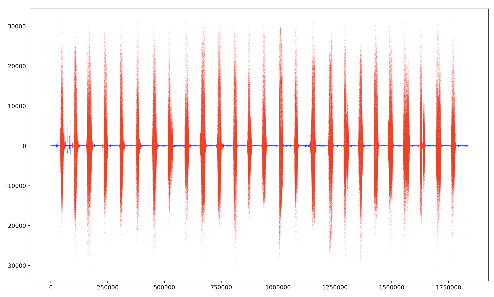

# Speech-Segmentation

### Segment patches of audio data ###

#### Input/Output ####
- Current usage segments .wav audio files.
- Each input file contains the spoken alphabet.
- Speech-Segmentation pipeline segments each .wav file into 26 separate .wav files, each containing a distinct spoken letter.  

**audioProcessing.py**
  - audio processing and speech segmentation methods
  
**Performance Parameters**
  - optimal parameters will likely need to be found by trial and error initially 
  - **Moving Average Window and Scale**
    - moving average window size is automaticlly set to n_speech_blocks * scale, and is centered (left and right = windowsize / 2)
    - scale shrinks the windowsize to avoid oversmoothing (best smoothing results when setting scale ~4)
  - **Segmentation Threshold**
    - segmentation threshold performs well at 0.05 (95% above threshold kept)
  

**Note:**
- Input data was aquired from https://robertmassaioli.bitbucket.io/alphabet-upload.html?
